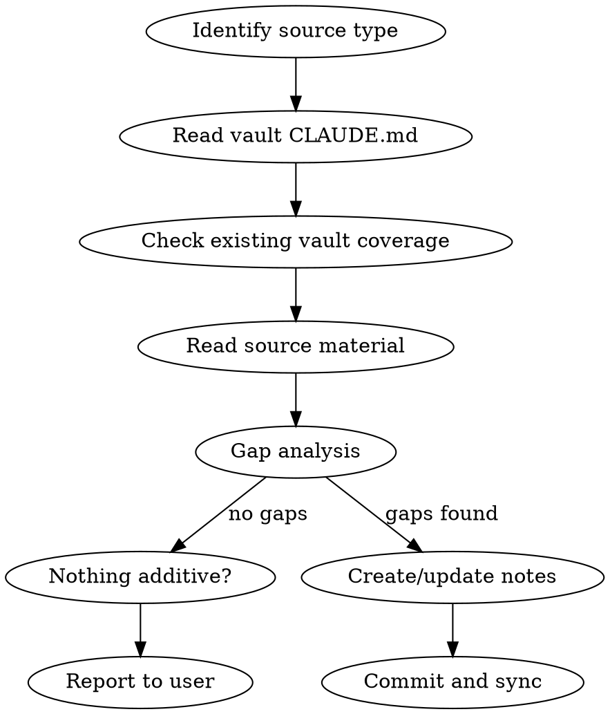

# Vault Knowledge Ingestion

Structured workflow for consuming external knowledge sources into the jemsu Obsidian vault. Avoids duplication, follows vault conventions, produces human-readable notes.

## Core Principle

**Read the source. Check what the vault already knows. Identify the delta. Write only what's additive.**

## Workflow



1. **Identify source type** — paper, repo, Zotero entry, local machine, document
2. **Read `~/vault/.claude/CLAUDE.md`** — understand structure, conventions, templates
3. **Check existing coverage** — search vault for related notes (grep titles, tags, wikilinks)
4. **Read source** — use source-specific methods below
5. **Gap analysis** — what does the source know that the vault doesn't?
6. **Create/update notes** — follow conventions, use templates, wikilink to related notes
7. **Commit and sync** — `v sync` or `git add && git commit && git push`

## Source-Specific Methods

### Papers and Academic Documents

**From Zotero** (library at `~/Zotero`):
```bash
# Zotero DB is SQLite — copy to avoid lock (Zotero holds lock while running)
cp ~/Zotero/zotero.sqlite /tmp/zotero_ro.sqlite
```

Query pattern for metadata:
```python
import sqlite3
db = sqlite3.connect('file:///tmp/zotero_ro.sqlite?mode=ro', uri=True)
cursor = db.cursor()

# Search by title keywords
cursor.execute('''
    SELECT i.itemID, it.typeName, f.fieldName, idv.value
    FROM items i
    JOIN itemTypes it ON i.itemTypeID = it.itemTypeID
    JOIN itemData id ON i.itemID = id.itemID
    JOIN itemDataValues idv ON id.valueID = idv.valueID
    JOIN fields f ON id.fieldID = f.fieldID
    WHERE idv.value LIKE ?
''', ('%search term%',))

# Get authors for an itemID
cursor.execute('''
    SELECT c.firstName, c.lastName
    FROM itemCreators ic
    JOIN creators c ON ic.creatorID = c.creatorID
    WHERE ic.itemID = ?
    ORDER BY ic.orderIndex
''', (item_id,))

# Get attached PDF path
cursor.execute('''
    SELECT ia.path FROM itemAttachments ia
    WHERE ia.parentItemID = ?
''', (item_id,))
# Path format: "storage:filename.pdf" → ~/Zotero/storage/<key>/filename.pdf
```

**From a paper repo** (Rmd, LaTeX, Quarto):
- Read the main document and child files
- Extract: title, authors, abstract, key methods, main findings, citation key
- Don't duplicate the full paper — summarize what's useful for the vault

**What to extract from papers:**
- Core contribution (1-2 sentences)
- Methods/framework that are reusable knowledge
- Related work landscape (comparison tables are gold)
- Limitations and open questions
- Citation metadata for frontmatter

**Vault location:** `paper/` for standalone paper notes, or inline in project notes if paper is part of an active project.

### Code Repositories

- Read README, docs/, setup-docs/, Makefile
- Identify architecture decisions and rationale
- Don't copy scripts or configs — summarize and link
- Use `repo:` and `repo_docs:` frontmatter to link back

**What to extract:**
- Architecture and design decisions (the "why")
- How components fit together
- Operational knowledge that isn't obvious from code
- Cross-machine patterns worth documenting

**Vault location:** `infra/<machine>/` for infrastructure repos, project folders for project repos.

### Local Machine State

Follow the Agent Discovery checklist in `~/vault/.claude/CLAUDE.md`. Key sources:

| Check | Command |
|---|---|
| Hostname | `hostname` |
| Services | `systemctl list-units --type=service --state=running` |
| Storage | `df -h`, `zpool status` |
| Network | `ip addr`, reverse proxy configs |
| Scheduled | `crontab -l`, `systemctl list-timers` |
| Software | package managers, `module avail`, custom installs |
| Local docs | README files, setup-docs/, wiki/ |

**Vault location:** `infra/<machine>/`

### Meeting Notes and Documents

- Extract action items, decisions, key facts
- Link to relevant project notes
- Tag with participants if relevant

**Vault location:** project folder or `dailies/` depending on scope.

## Vault Conventions (Quick Reference)

| Convention | Rule |
|---|---|
| Links | `[[wikilinks]]` always |
| Frontmatter | `title`, `tags` (YAML list, kebab-case) minimum |
| Infra notes | Add `repo:`, `repo_docs:`, `machine/hostname` tag |
| Templates | `templates/infra.md`, `templates/note.md`, `templates/paper.md` |
| Don't | Dump raw configs. Duplicate operational code. Restructure `personal/health/`. |

## Gap Analysis Checklist

Before creating notes, verify:
- [ ] Does the vault already have a note covering this? (search by title, tag, content)
- [ ] Is the information already present in an existing note? (read candidates)
- [ ] Would this be better as an update to an existing note vs a new note?
- [ ] Is this operational detail that belongs in a repo, not the vault?
- [ ] Will this be useful to a human reading in Obsidian?

## Common Mistakes

- **Dumping raw content** — summarize and explain, don't paste
- **Missing wikilinks** — always link to related vault notes
- **Wrong location** — check CLAUDE.md structure table
- **Forgetting frontmatter** — every note needs title + tags minimum
- **Not checking existing coverage** — search first, write second
